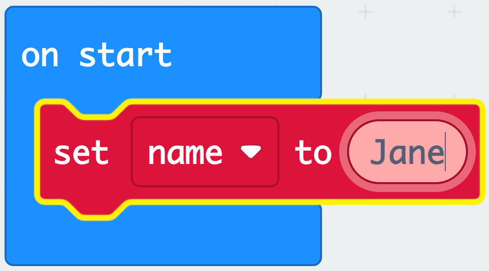
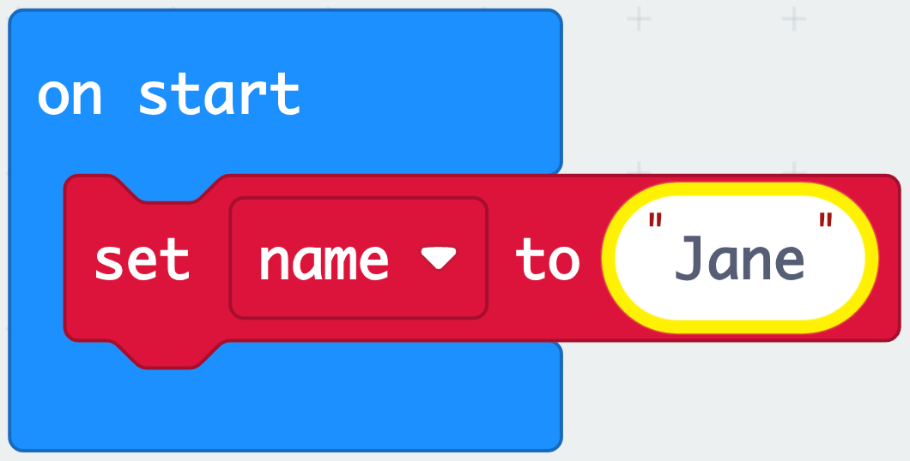
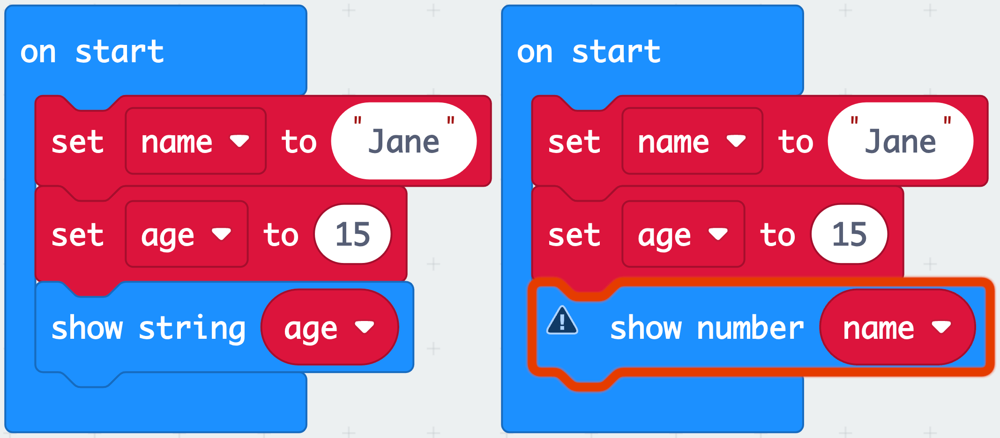

# The String Basic Type

Computers manipulate data. Data can come in several forms. Not all data is handled the same way, so information is organized into different types. The same operations can be used to manipulate the data within data types. Consider the following examples:

`100` is a number that can be used in mathematical computations. The `'100'` in the sentence, `I have 100 things in my mind.' ` Is part of a sequence of characters. A series of characters in computer science is called a **string**. 

In MakeCode, strings are characters between double `" "` quotes.

Makecode will not allow users to use strings where a number value is expected. It will highlight the error in red:

If a string is placed in the example above, the TODO:REWORD

MakeCode will automatically convert numbers to strings but cannot convert strings to numbers.

