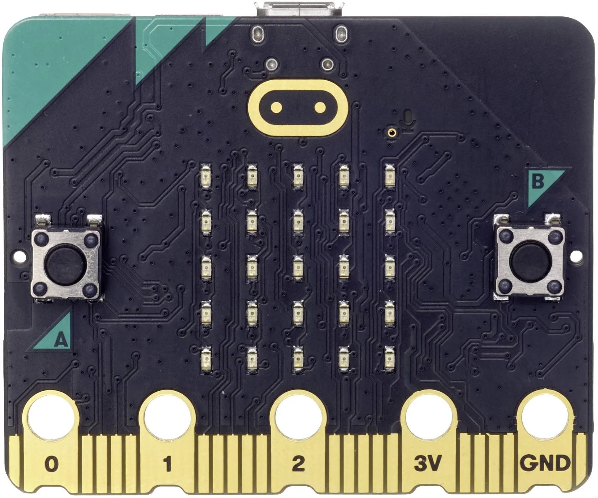

# What is the BBC micro:bit

The BBC micro:bit is a compact, programmable microcontroller designed by the BBC for educational purposes in the United Kingdom. It is an excellent tool for introducing young learners to coding, electronics, and creative problem-solving. Here are some key features:

The micro:bit has:

- A 5x5 LED matrix display (with light sensing capabilities)
- Two programmable buttons
- A temperature sensor
- An accelerometer and gyroscope
- A capable of sensing touch
- A buzzer
- A microphone
- 19 general-purpose input/output pins to connect external inputs, outputs, sensors, actuators, and other electronic components. 

The BBC micro:bit is programmable using MakeCode (a block-based language) and MicroPython (a subset of the Python programming language).