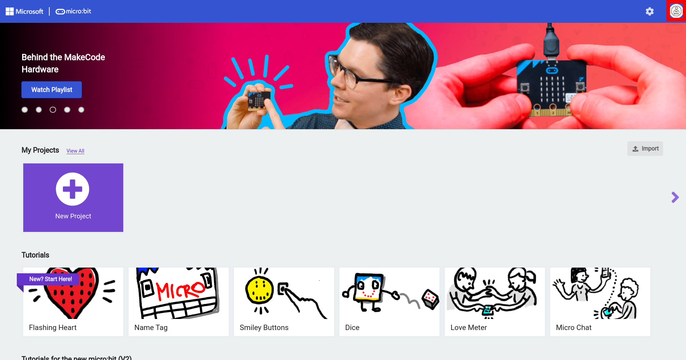

# The MakeCode Editor

TODO:FIND OUT IF MAKECODE EDITOR HAS SIGN IN FOR GOOGLE CLASSROOM. MAY NEED SEPARATE SECTION.


## Signing Into MakeCode

It is possible to use MakeCode with out signing in, but projects may be deleted after a while or disappear if the browser history is cleared. To sign in click on the "Sign In" button on the upper right corner:


A window will appear to enter your credentials. Use the proper service as indicated by the instructor.


When the sign in button will change to the picture provided with your email account once signed in, and projects will be saved automatically.

 

---

## Parts of the MakeCode Editor

The various parts of the MakeCode Editor are labeled below:


|      | Area/Button           | Description                                                  |
| ---- | --------------------- | ------------------------------------------------------------ |
| 1    | MakeCode Editor       | This is where blocks are placed from the Toolbox. These blocks will be executed and transferred to the micro:bit using the "Download" button. |
| 2    | Toolbox               | All of the blocks needed to code the micro:bit are divided into categories and color-coded to match each category in the toolbox. |
| 3    | micro:bit Simulator   | When code blocks are placed in the MakeCode Editor from the Toolbox, the simulator displays what the program does on the micro:bit simulator. The simulator can will refresh automatically when the code is changed. It is possible to stop, refresh, and debug the simulator. There are also buttons to take screenshots of the simulator and display the simulator in full-screen mode. |
| 4    | Download Button       | The download button has two parts. The part on the left labeled "Download" downloads the code to the micro:bit after it has been paired with the computer. The part on the right with three dots connects or pairs the micro:bit and disconnects it. |
| 5    | Project Title         | This is where the project title can be changed. Files downloaded to be saved on the computer will be named according to the text in this field. |
| 6    | Home Button           | The home button navigates the user to the start screen where the latest active projects are displayed, and other projects |
| 7    | Share Button          | This button generates links for others to view the project.  |
| 8    | Help Button           | This buton opens a tour to the MakeCode editor, opens the support page for micro:bit, |
| 9    | Settings Button       |                                                              |
| 10   | Sign In Button        |                                                              |
| 11   | Undo and Redo Buttons |                                                              |
| 12   | Zoom Buttons          |                                                              |

There is also a place to toggle between blocks and text-based coding. This area is beyond the scope of this lesson. TODO:AVOID


```{note}
In order to save work indefinitly students must sign into the editor. Work may be saved for a short period of time without signing in, but projects will disappear at some point.
```


TODO