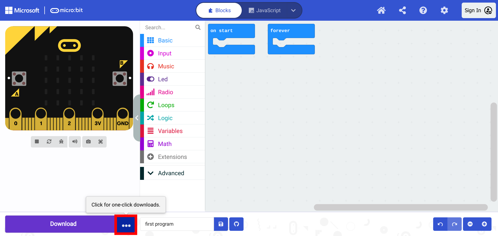
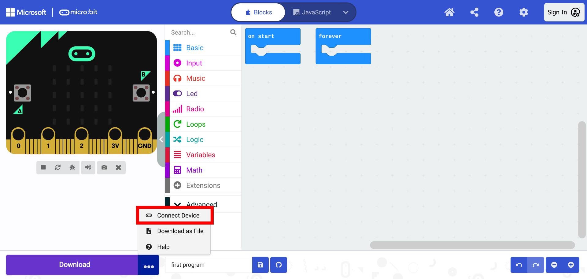
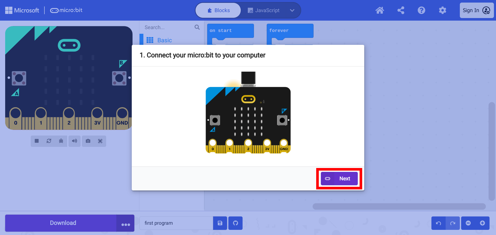
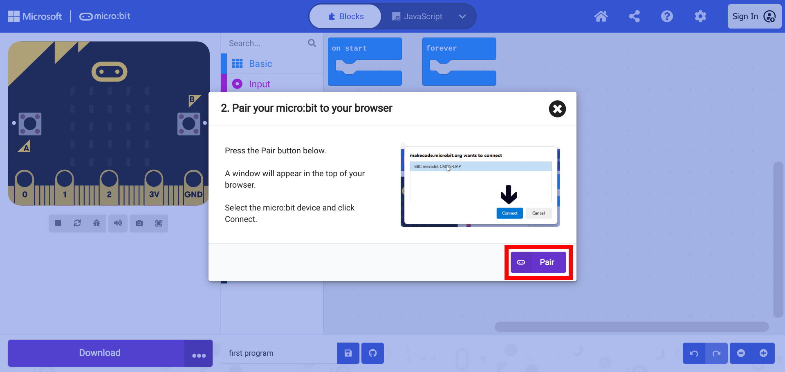
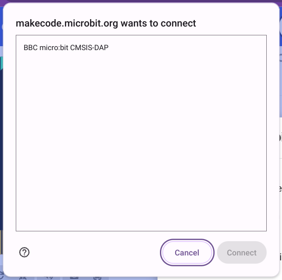
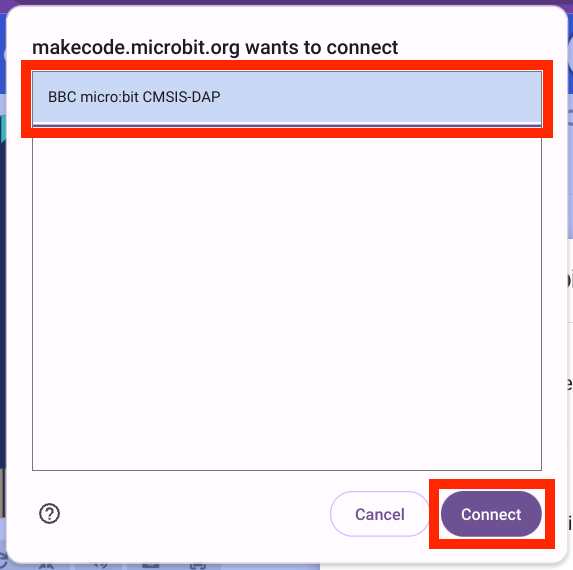
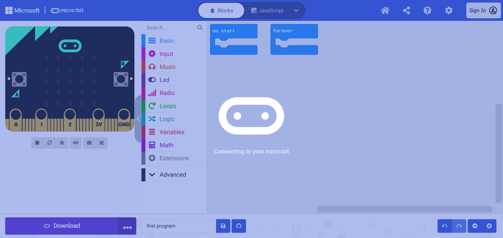
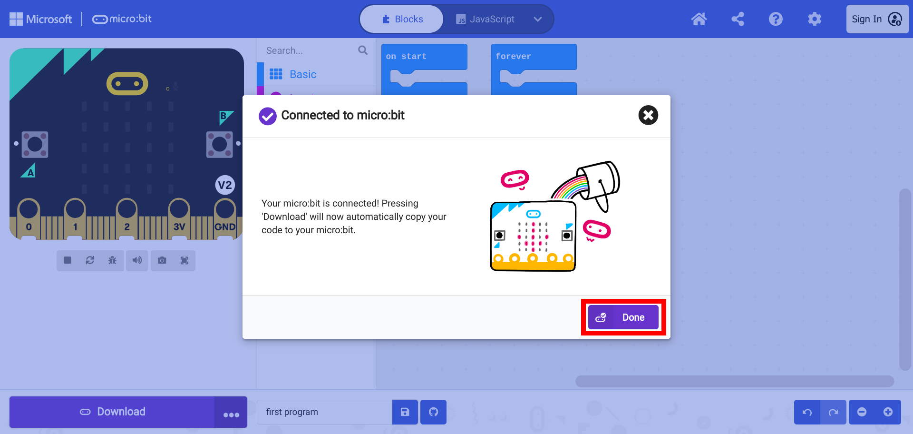

# Connecting the micro:bit to a Computer

Click on the button  to start the process of connecting the micro:bit.



Select "Connect Device".



A window will appear with a prompt to connect the micro:bit. Connect the micro:bit using a micro-USB cable with the proper connection for the computer. And select "Next".



Another window appears with a prompt to pair the micro:bit with the computer. Select "Pair".



A window appears with a list of devices.

```{warning}
Attaching more than one micro:bit to the computer can cause complicate this process. Only one device should be connected and listed in the window.
```




Select the device and select "Connect".



The computer will then connect to the micro:bit.



When pairing is complete, select "Done".



The micro:bit is now ready to be flashed with code.