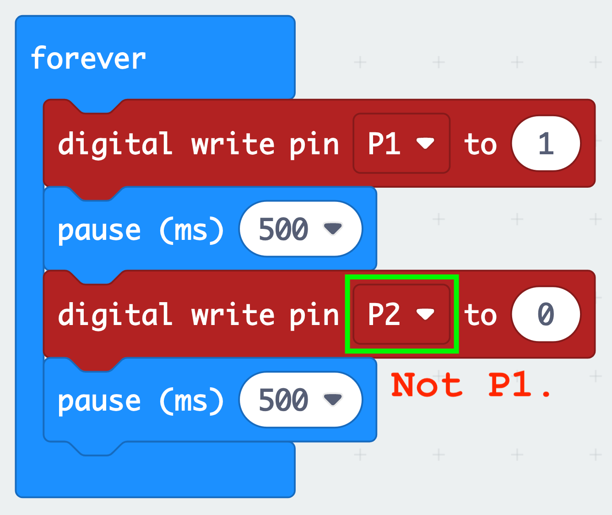
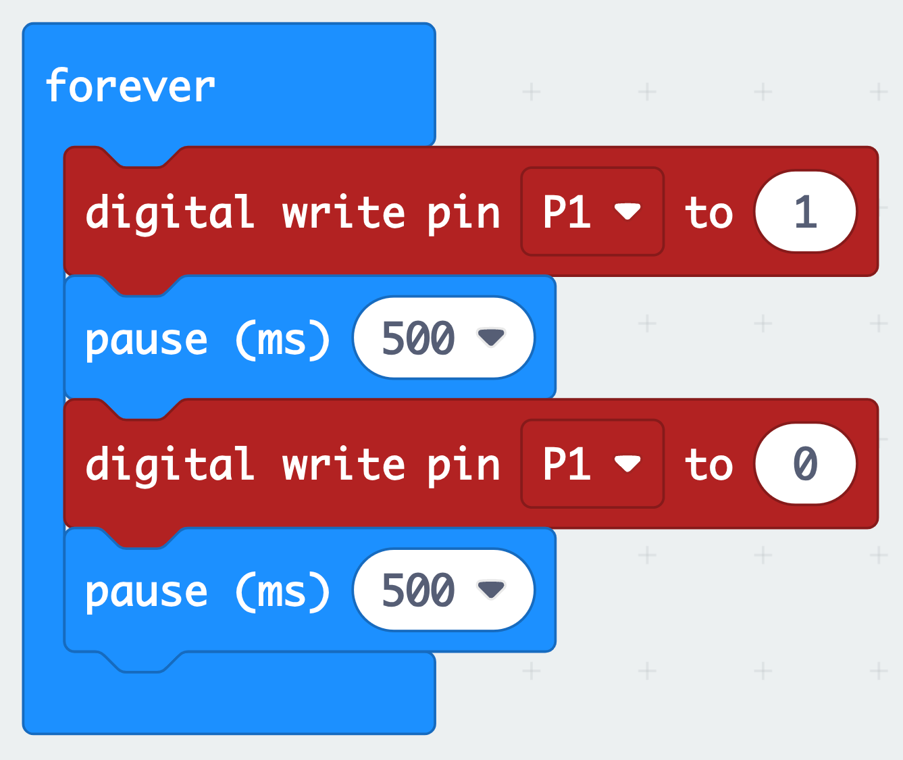

# Blinking an LED

TODO

## Debugging

The following code block displayed below is supposed to make an LED on P1 blink, but it is not working. How can the code be fixed?


```{admonition} Click here to reveal the solutions.
:class: dropdown
Solution:


The pin is not set to `P1` in the second `digital write pin` block. Changing `P2` to `P1` will fix the code.



```