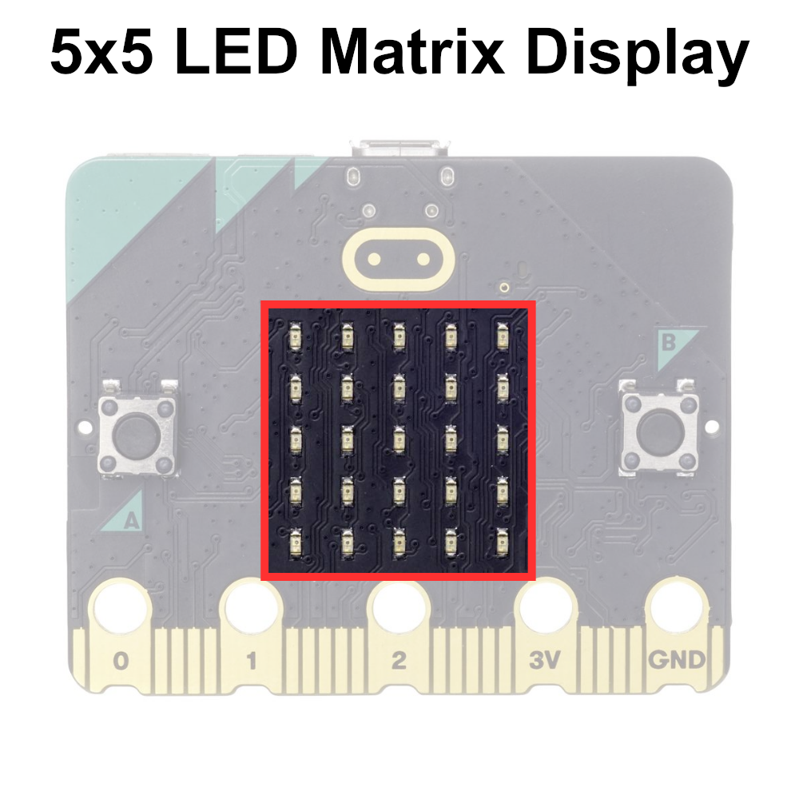

# The micro:bit Display

The micro:bit 5x5 LED matrix display is a grid of 25 individually addressable light-emitting diodes (LEDs) arranged in a 5 by 5 matrix configuration. Each LED can be controlled independently, displaying various patterns, shapes, and characters.

The LED matrix serves as the primary output interface for the micro:bit, providing a simple and intuitive way to convey information and interact with users visually. 

