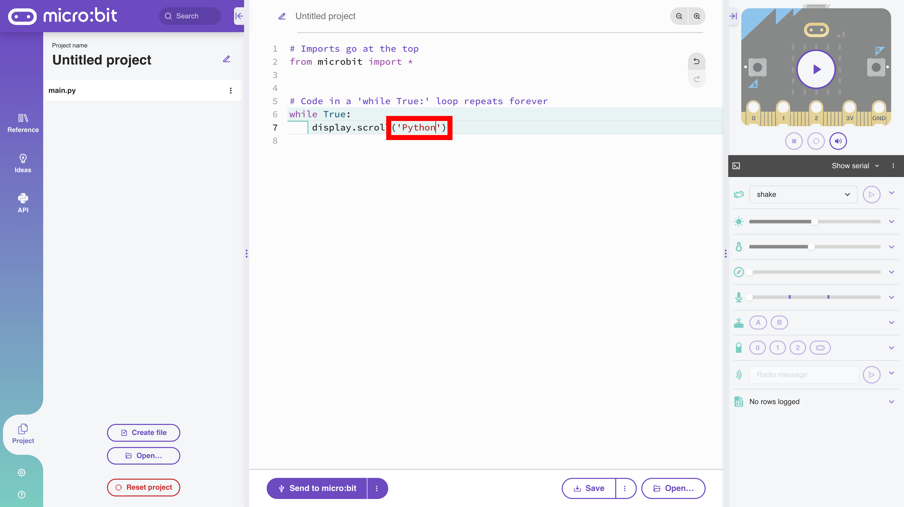

# Displaying Strings

To display a string on the micro:bit 5x5 LED matrix using Python, there are two methods. The string `'Python'` will be displayed on the 5x5 LED matrix in the following examples using both methods.

## Displaying Strings with Python

### `display.scroll()`

The `display.scroll()` method scrolls a string from right to left on the 5x5 LED matrix.


Delete all the lines of code from the default starter code on the start screen except for `displyy.scroll('Hello')`.


Change the string from `'Hello'` to `'Python'`.



The code should be as follows:

```python
# Imports go at the top
from microbit import *


# Code in a 'while True:' loop repeats forever
while True:
    display.scroll('Python')

```

Test the code in the micro:bit simulator in the upper right corner of the Python editor.


Run the code on the micro:bit. See TODO.

TODO:IMAGE OF CODE RUNNING ON DEVICE

---

### `display.show()`

The `display.show()` method displays each character a string individually on the 5x5 LED matrix.


Replace `scroll` in the `display.scroll()` method with `show`.


The code should be as follows:

```python
# Imports go at the top
from microbit import *


# Code in a 'while True:' loop repeats forever
while True:
    display.show('Python')

```

Test the code in the micro:bit simulator in the upper right corner of the Python editor.


Run the code on the micro:bit.
