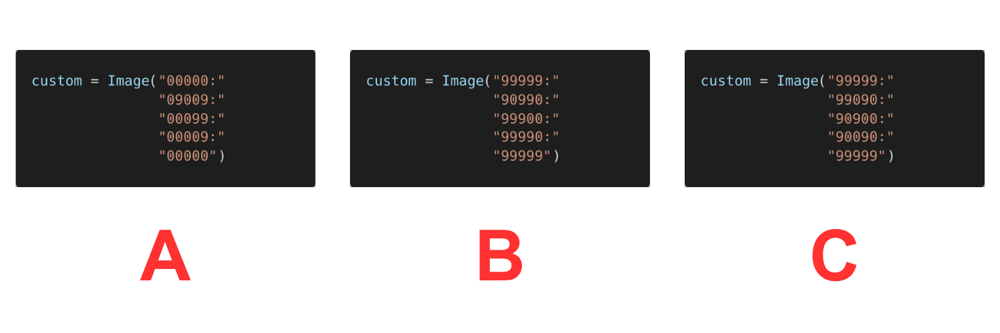

# Displaying Custom Images

It is possible to create custom images on the 5x5 LED matrix display. TODO


## Creating a Custom Image of A Coyote


There are two methods to create a custom of the coyote above. TODO

### Method #1 (More Visual)

```python
# Imports go at the top
from microbit import *

# Create a custom image of a coyote
coyote = Image("99099:"
               "09990:"
               "90909:"
               "99999:"
               "00900")

# Display the custom image
display.show(coyote)

```


### Method #2 (One Line)

```python
# Imports go at the top
from microbit import *

# Create a custom image of a coyote
coyote = Image("99099:09990:90909:99999:00900")

# Display the custom image
display.show(coyote)

```


## 


## Checkpoint: Creating Custom Images


Which of the snippets for a custom image is used for the image above?




```{admonition} Click here to reveal the solutions.
:class: dropdown
Solutions:

```