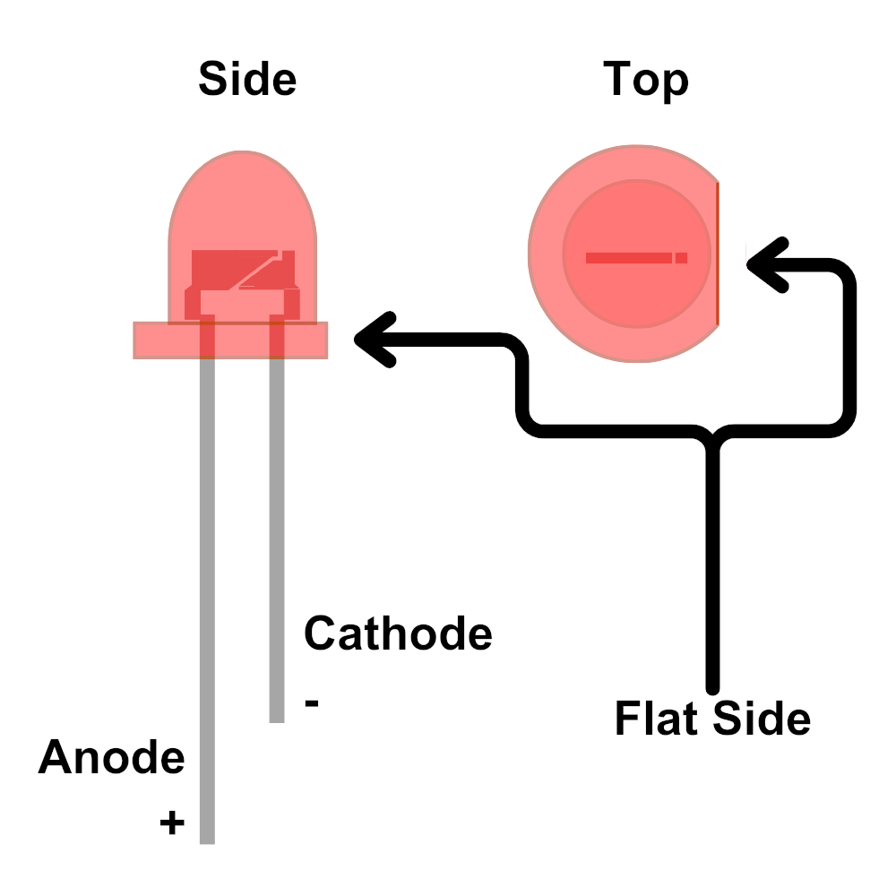
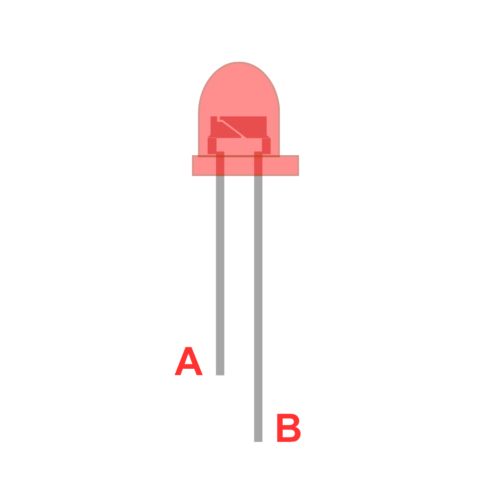

# Light-emitting Diodes (LEDs)

TODO

## Parts of an LED



## Checkpoint: Anode or Cathode

Which lead is the anode? Which lead is the cathode? What is the polarity of the different leads?




```{admonition} Click here to reveal the solutions.
:class: dropdown
Solution:


**A** has the flat side and the shorter lead so it is the **cathode**. The polarity is **negative**.<br>
**B** has the longer lead so it is the **anode**. The polarity is **positive**. 


```