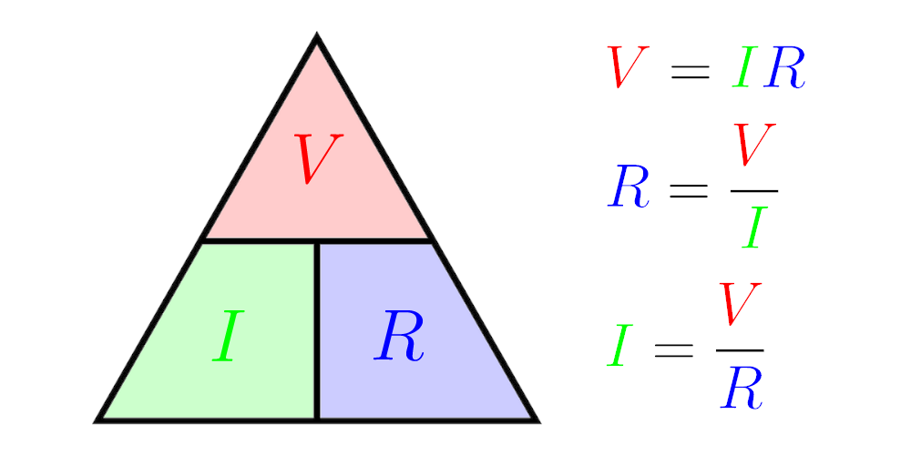
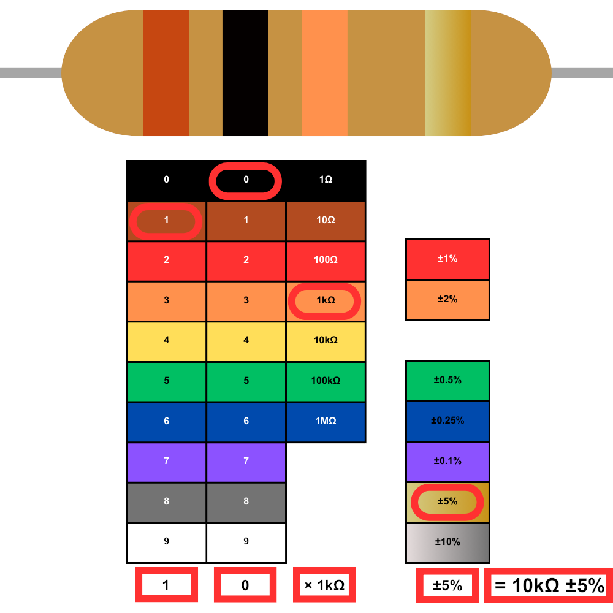

# Resistors

## What is a Resistor?


## Ohm's Law

TODO



TODO


## Resistor Color Codes

TODO


Four-band resistors are more common in hobby kits. They are also easier to interpret as the colors are easier to distinguish. TODO

TODO: LINK TO FIVE-BAND CHART 


TODO



## Checkpoint: Interpreting Resistor Values  


```{admonition} Click here to reveal the solutions.
:class: dropdown
Solutions:

A: 1, 0, 1kΩ ⟹ 10 × 1kΩ = 10kΩ<br>
B: 2, 7, 100Ω ⟹ 27 × 10Ω = 270Ω<br>
C: 4, 7, 100Ω ⟹ 47 × 100Ω = 4700Ω = 4.7kΩ<br>
D: 1, 0, 10Ω ⟹ 10 × 10Ω = 100Ω
```