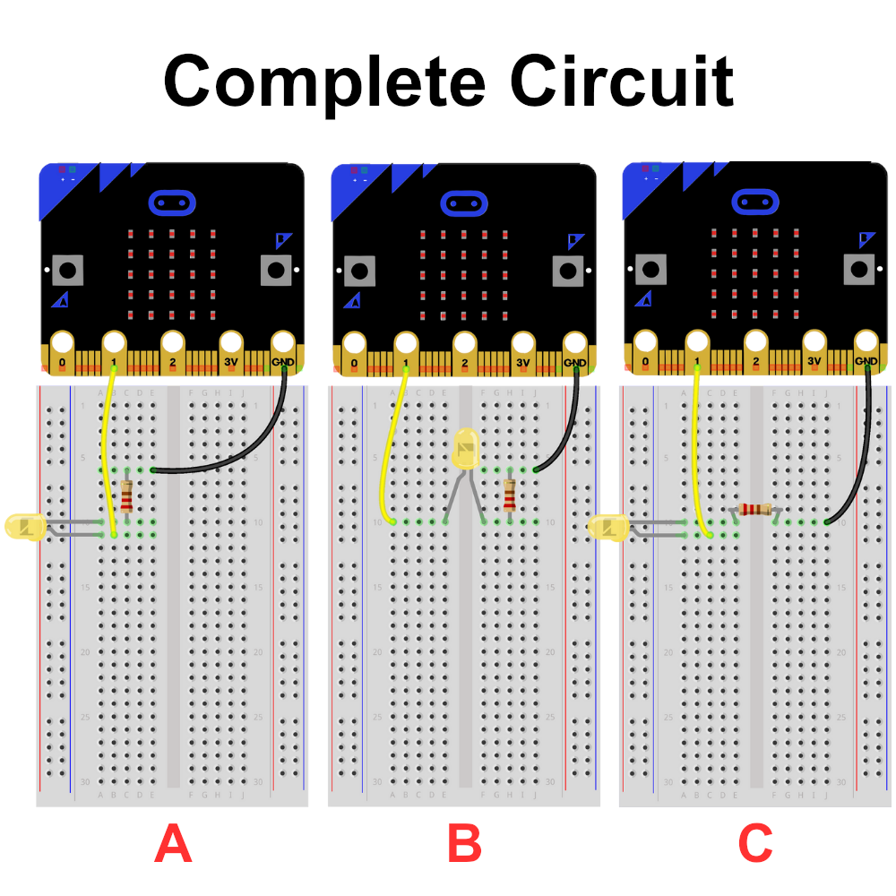
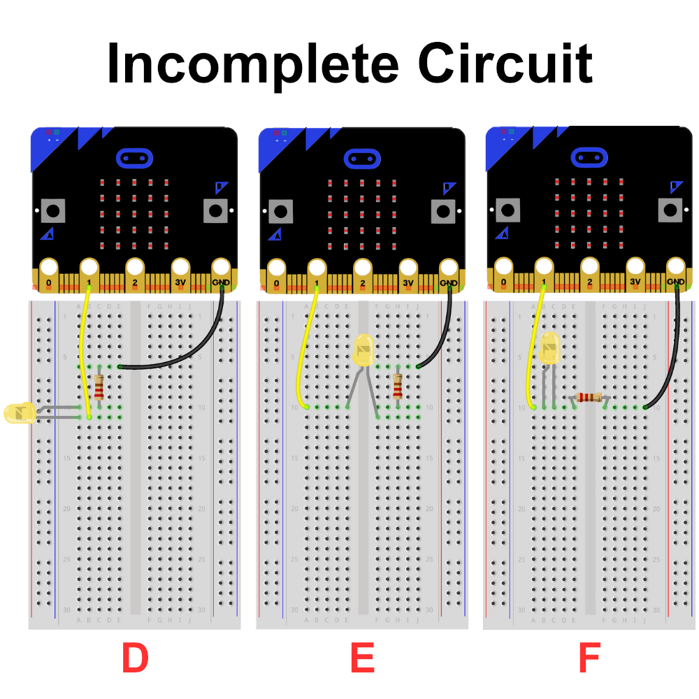
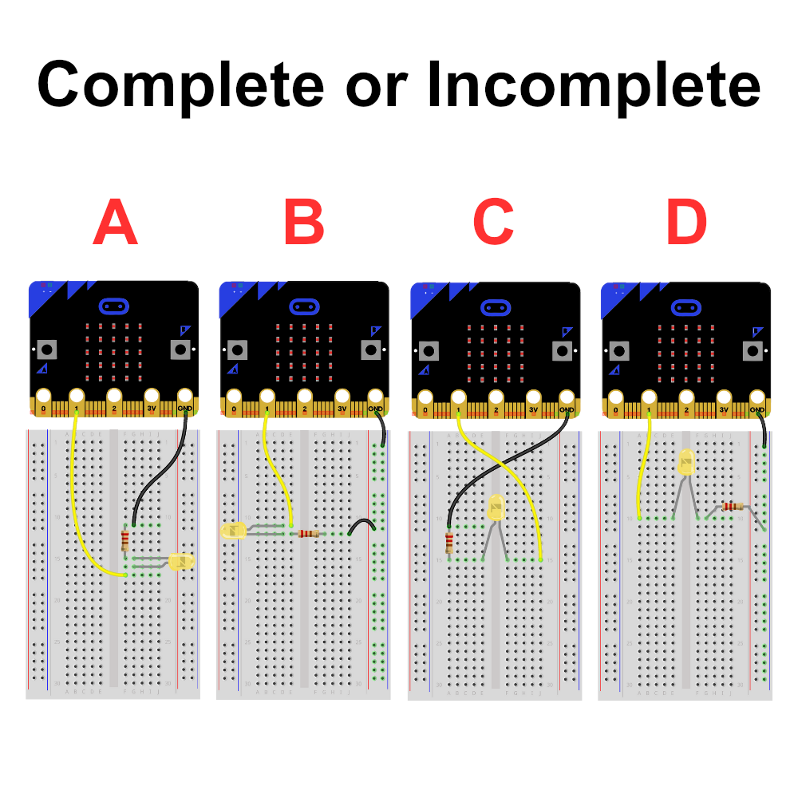
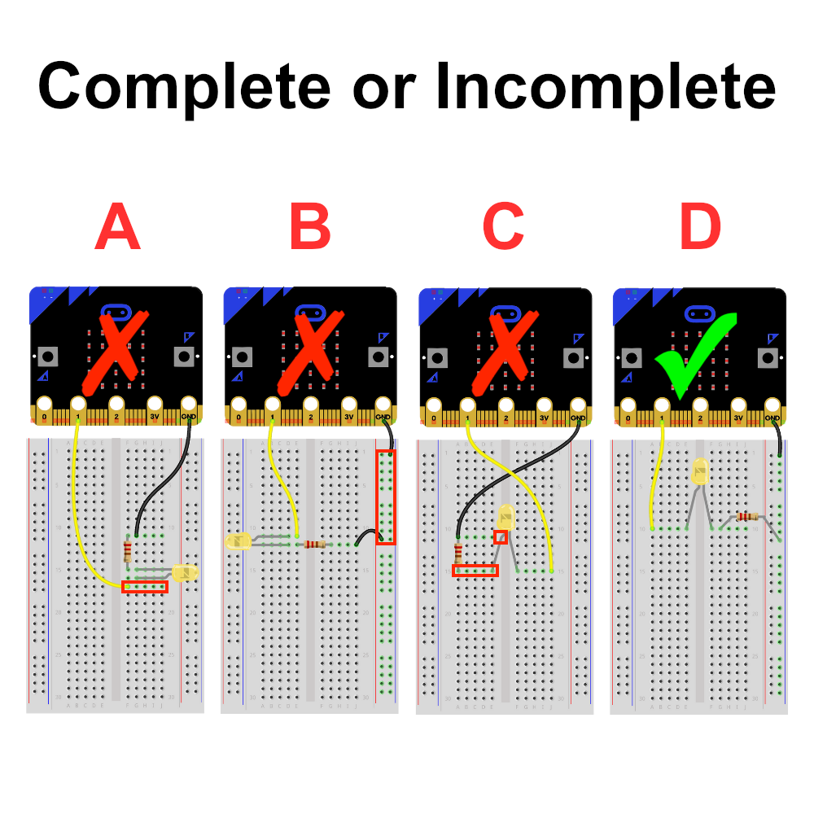

# Complete and Incomplete Circuits

TODO

## Complete Circuits

A complete circuit refers to an electrical circuit in which there is a continuous pathway for electric current to flow from the power source through various components and back to the source. In a complete circuit, all necessary elements, such as conductors, loads (e.g., resistors, light bulbs, motors), and a power source (e.g., battery, generator), are connected in a closed loop, allowing current to flow freely.

Here are some examples of complex circuits



## Incomplete Circuits

In contrast, an incomplete circuit, also known as an open circuit, refers to a circuit where there is a gap or break in the pathway, preventing the flow of electric current. This can occur if a component is disconnected or if there is a break in the wiring. In an incomplete circuit, current cannot flow through the circuit, and the electrical load does not receive power.

Here are some examples of incomplete circuits:



## Checkpoint: Complete or Incomplete

Which circuits are complete or incomplete?



```{admonition} Click here to reveal the solutions.
:class: dropdown
Solutions:

**A**: This is an incomplete circuit, because input/output pin is not connected to the same row the annode of the LED is connected to.<br>
**B**: This is an incomplete circuit, because the GND pin is not connected to the sane row as the jumper attached to the resistor.<br>
**C**: This is an incomplete circuit, because the annode is attached to the GND pin.<br>
**D**: This is a complete circuit.
```