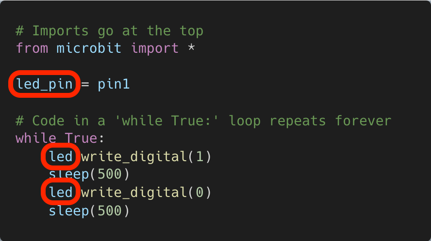

# Blinking an LED


TODO

```python
# Imports go at the top
from microbit import *

# Set the LED pin
led_pin = pin1

# Code in a 'while True:' loop repeats forever
while True:
    # Turn the LED on
    led_pin.write_digital(1)
    # Wait for 500ms (0.5 seconds)
    sleep(500)
    # Turn the LED off
    led_pin.write_digital(0)
    # Wait for 500ms (0.5 seconds)
    sleep(500)

```

## Debugging

The following code is supposed to make an LED on `pin1` blink, but it is not working. How can the code be fixed?


```{admonition} Click here to reveal the solutions.
:class: dropdown
Solution:


The variable pointing to `pin1` is `led_pin`, but the variable used in the `while` loop is `led`. This variable has not been declared. Changing `led` to `led_pin` will fix the code.


```