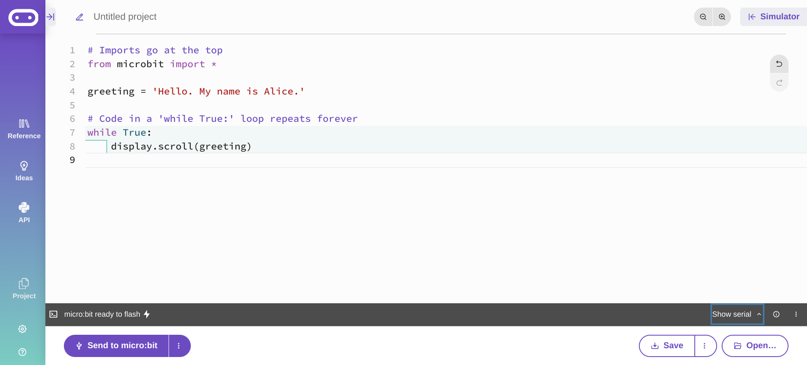
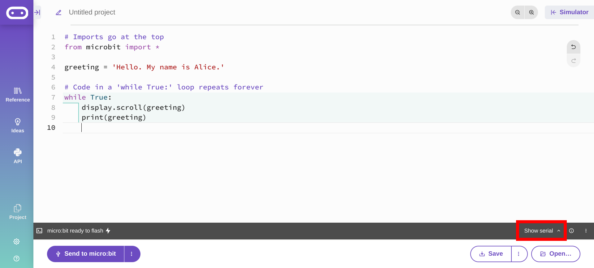
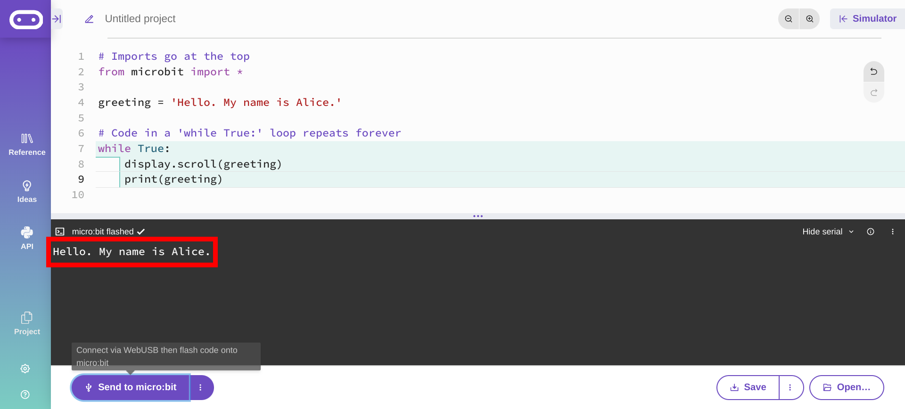

# Serial

The micro:bit display is an excellent way to display data, but sometimes data changes faster than the `display.scroll()` method. There is another way to display data using the `print()` function. 

TODO



TODO

```python
# Imports go at the top
from microbit import *

greeting = 'Hello. My name is Alice.'

# Code in a 'while True:' loop repeats forever
while True:
    display.scroll(greeting)

```

TODO



TODO

```python
# Imports go at the top
from microbit import *

greeting = 'Hello. My name is Alice.'

# Code in a 'while True:' loop repeats forever
while True:
    display.scroll(greeting)
    print(greeting)

```
TODO



TODO