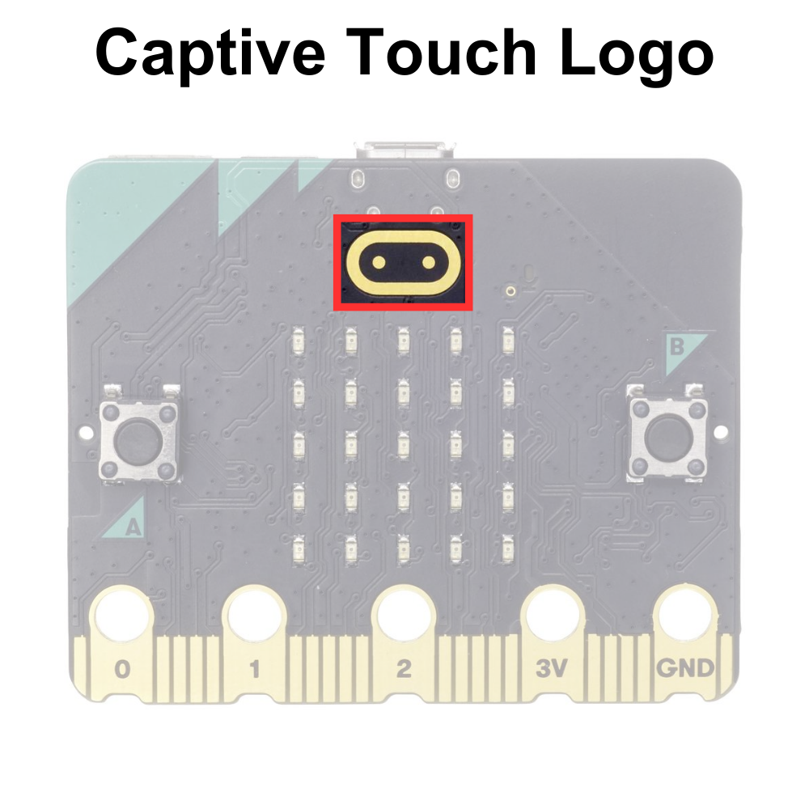

# The Captive Touch Logo

The micro:bit captive touch logo is a touch-sensitive pad located on the front of the microcontroller board, just below the LED matrix display. It uses the electrical properties of the human body to behave similarly to a button. 

The captive touch logo can be programmed to respond to touch events, enabling users to trigger actions, control functionality, or provide input to micro:bit programs. It offers a simple and intuitive way to interact with the device without the need for physical buttons or external sensors.

The captive touch logo is displayed below:



## Displaying the State of the Captive Touch Logo on the micro:bit Display

TODO

## Printing the State of the Captive Touch Logo to Serial


```python
# Imports go at the top
from microbit import *

# Code in a 'while True:' loop repeats forever
while True:
    # Print the state of the logo touch sensor
    print('Logo touched:', pin_logo.is_touched())
    sleep(100) # Wait for 100ms (0.1 seconds)
```

