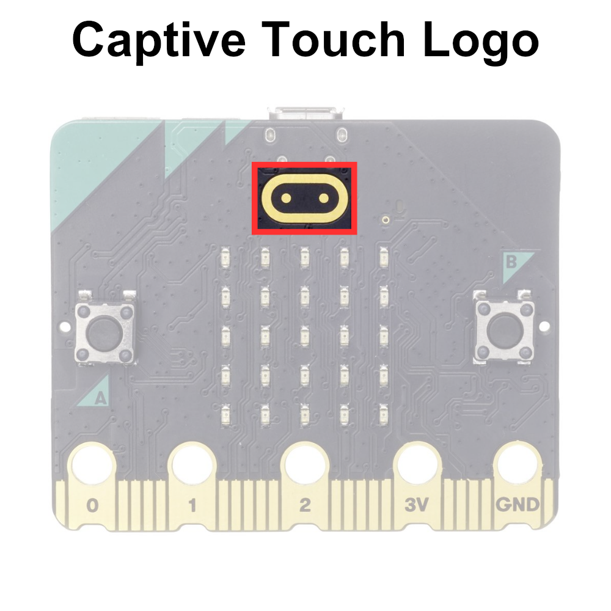

# The Captive Touch Logo

The micro:bit gas a captive touch logo that can be used similar to a button. The logo uses the electrical properties of the human body to TODO




## Printing the State of the Captive Touch Logo to Serial


```python
# Imports go at the top
from microbit import *

# Code in a 'while True:' loop repeats forever
while True:
    # Print the state of the logo touch sensor
    print('Logo touched:', pin_logo.is_touched())
    sleep(100) # Wait for 100ms (0.1 seconds)
```

