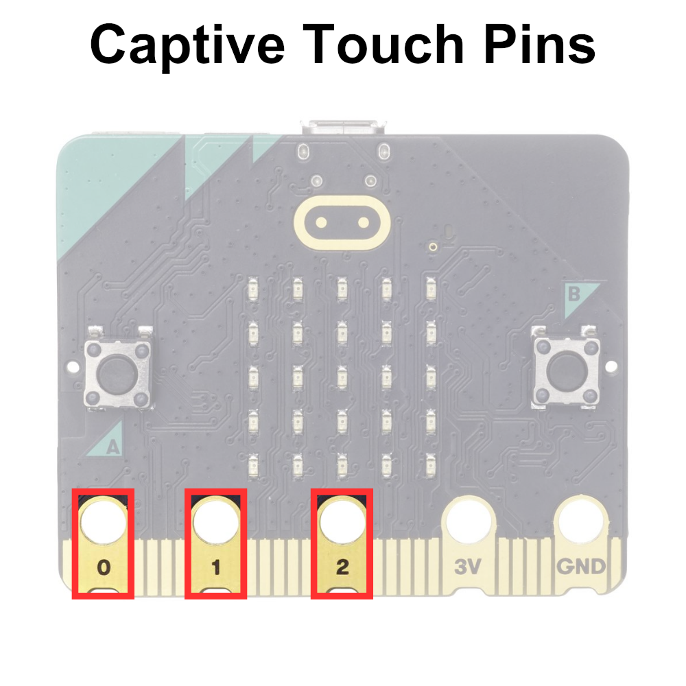

# The Captive Touch Pins

The captive touch pins 0, 1, and 2 on the micro:bit are touch-sensitive input pins located along the edge of the microcontroller board similar to the captive touch logo. These pins allow users to detect touch input by capacitive sensing.

Users can connect conductive materials, such as wires, foil, or conductive thread, to these pins to create touch-sensitive interfaces for their micro:bit projects. When a user touches or comes into close proximity to the connected conductive material, the capacitive touch sensing circuit detects the change in capacitance and registers it as a touch event.

```{note}
Unlike the captive touch logo, the captive touch pins need to make contact with the GND pin to complete the circuit.
```

The captive touch pins are displayed below:



## Displaying the State of the Captive Touch Buttons on the micro:bit Display

TODO

## Printing the State of the Captive Touch Pins to Serial


```python
# Imports go at the top
from microbit import *

# Code in a 'while True:' loop repeats forever
while True:
    # Print the state of pin 0, pin 1 and pin 2 touch sensors
    print('Pin 0:', pin0.is_touched(), 'Pin 1:', pin1.is_touched(), 'Pin 2:', pin2.is_touched())
    sleep(100) # Wait for 100ms (0.1 seconds)
```

