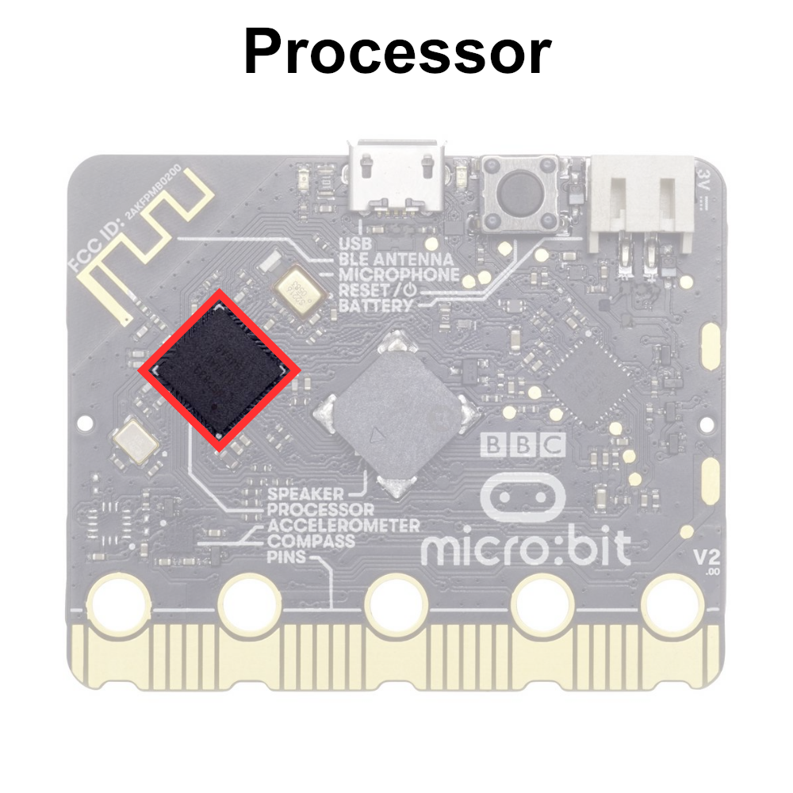

# The Temperature Sensor

The micro:bit uses the temperature sensor on the processor to sense the temperature. The accuracy of the temperature sensor ±5℃.



## Printing the Temperature Reading to Serial


```python
# Imports go at the top
from microbit import *

# Code in a 'while True:' loop repeats forever
while True:
    # Print the temperature
    print('Temperature:', temperature(), 'C') 
    sleep(100) # Wait for 100ms (0.1 seconds)
```

