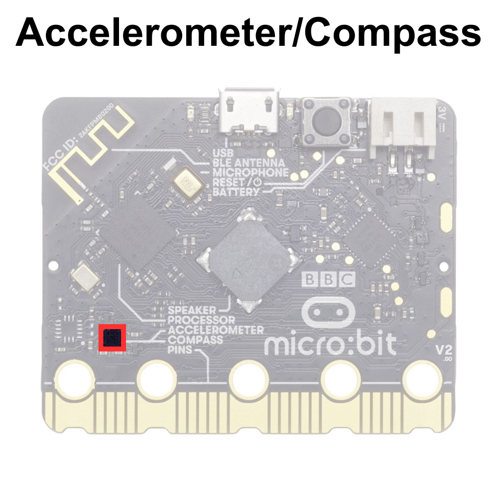

# The Accelerometer/Compass

## The Accelerometer

The micro:bit accelerometer is a built-in sensor that detects changes in acceleration and orientation along three axes: X, Y, and Z. This sensor measures the rate of velocity change, allowing the micro:bit to sense movement, tilt, and orientation changes.

Using the accelerometer, the micro:bit can detect various motions, such as shaking, tilting, or flipping, and respond accordingly in programmed applications. For example, it can be used to control games by tilting the micro:bit, trigger actions by shaking it, or detect gestures for user interaction.

## The Compass

In addition to detecting changes in acceleration, the built-in sensor also detects the direction of the Earth's magnetic field relative to the device's orientation. This sensor provides a digital compass functionality, allowing the micro:bit to determine its heading or orientation with respect to magnetic north.

Using the compass sensor, the micro:bit can detect orientation changes and provide directional information, which can be utilized in various applications. For example, it can be used to create digital compasses, navigation tools, or games that respond to changes in orientation.

The micro:bit accelerometer/compass is displayed below:

