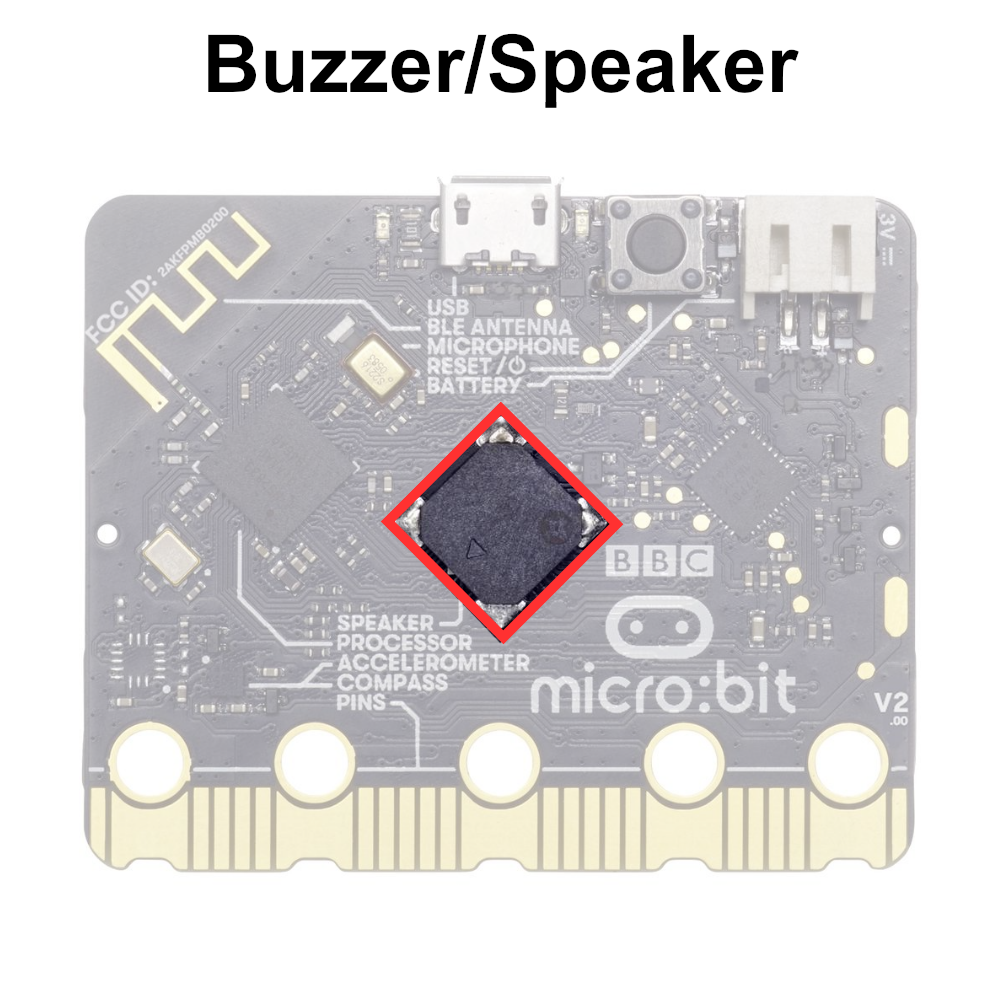

# The Buzzer/Speaker

TODO:ASK IF THIS MAY BE DISRUPTIVE

The micro:bit **piezoelectric buzzer** or sometimes called a speaker is a built-in output component that generates sound using a piezoelectric element. When an electric current is applied to the piezoelectric element, it vibrates at a high frequency, producing audible sound waves.

Using the piezoelectric buzzer, the micro:bit can produce various sounds, tones, and melodies based on instructions provided in programmed applications. This allows for auditory feedback, alerts, or entertainment in interactive projects.

```{note}
The component is often called a speaker, but it is a piezoelectric buzzer. Here are some of the key differences:<br>
**Piezoelectric Buzzer**: A piezoelectric buzzer generates sound through the piezoelectric effect, where an electric current causes a piezoelectric crystal to vibrate, producing sound waves directly. They often are used to produce simple sounds and beeps, because they have a limited frequency range. Piezoelectric buzzers can operate a minimal amount of power.<br>
**Speaker**: A speaker generates sound by converting electrical signals into mechanical vibrations using a diaphragm (usually made of paper, plastic, or metal) that moves air to produce sound waves. Speakers can produce more dynamic sounds, becaye they have a wider frequency range. Speakers require more power to produce sounds.
```


