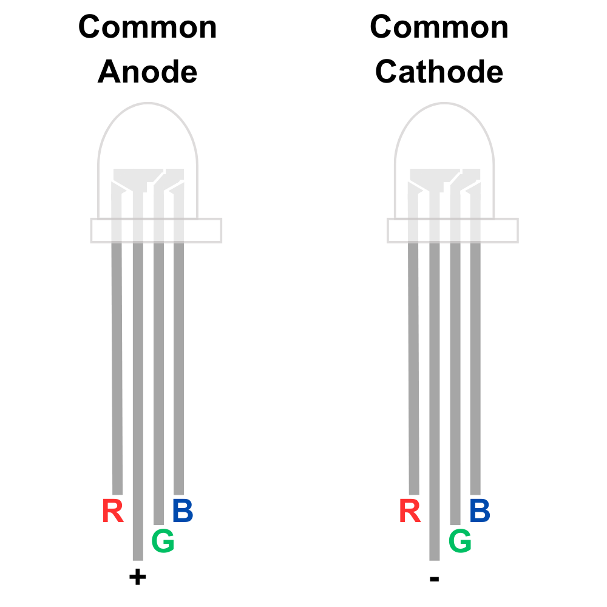

# RGB LEDs

TODO

## Common Anode and Common Cathode RGB LEDs

Common anode and common cathode RGB LEDs are both types of RGB LEDs used in electronic devices for color mixing and illumination.

In a **common anode** RGB LED, the anode (positive terminal) of all three individual LEDs (Red, Green, and Blue) are connected, while each cathode (negative terminal) is separate. This means that to illuminate a specific color, the cathodes of the desired LEDs are grounded, allowing current to flow through them and emit light.

On the other hand, in a **common cathode** RGB LED, the cathode of all three individual LEDs is connected, while each anode is separate. To produce a color, the anodes of the desired LEDs are connected to a voltage source, allowing current to flow and illuminate them.

In both types, the intensity of each color (Red, Green, and Blue) can be controlled independently to produce a wide range of colors by varying the amount of current flowing through each LED. Choosing between a common anode and a common cathode depends on the circuit design and compatibility with other components.

