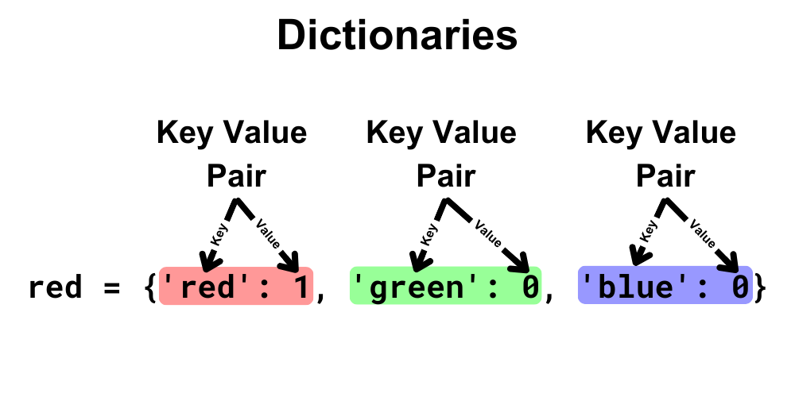
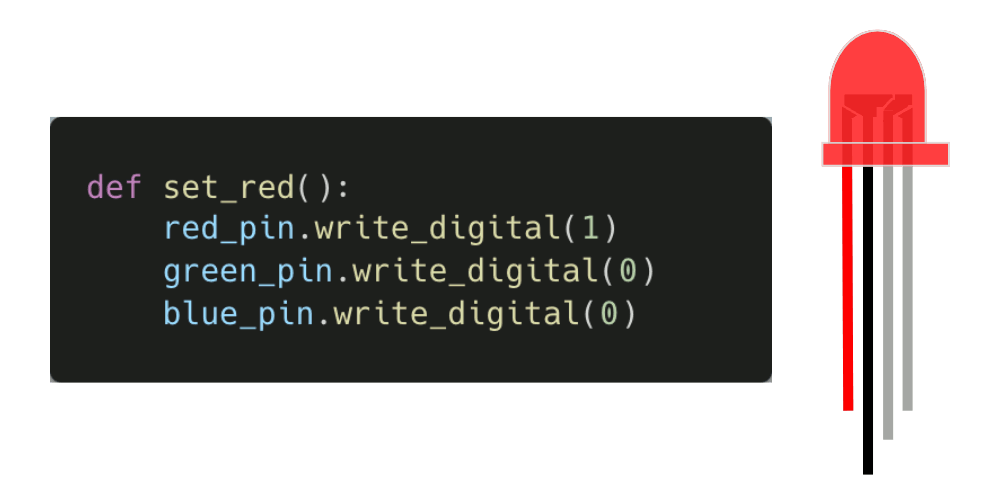

# Dictionaries

Python dictionaries are a fundamental data structure that stores and organizes data in key-value pairs. Each key in a dictionary maps to a corresponding value, allowing for efficient retrieval and manipulation of data. Dictionaries are versatile and commonly used in Python for tasks like mapping unique identifiers to associated values or storing configurations and settings. They provide a flexible way to structure and access data, making them an essential tool in Python programming.

## Key-Value Pairs

A **key-value pair** is a fundamental concept in computer science and data structures. In the context of dictionaries, it refers to two associated pieces of data: a key and a value.

A **key** is a unique identifier within the dictionary. It serves as the reference point for accessing the associated value. Keys are typically **immutable** objects such as strings, integers, or tuples, meaning they cannot be changed after creation.

A **value** is the data associated with a specific key in the dictionary. It can be of any data type, including strings, integers, floats, lists, tuples, dictionaries, or even custom objects. Each key in a dictionary maps to exactly one value.


## Anatomy of a Dictionary



## Creating Dictionaries


```python
# Dictionary with RGB values for red
red = {'red': 1, 'green': 0, 'blue': 0}
```


Here is an example of a program that flashes TODO



```python
# Imports go at the top
from microbit import *

# Set the LED pins
red_pin = pin1   # pin1 is the red pin
green_pin = pin2 # pin2 is the green pin
blue_pin = pin3  # pin3 is the blue pin

# Define the colors as dictionaries
red = {'red': 255, 'green': 0, 'blue': 0}       # Red
green = {'red': 0, 'green': 255, 'blue': 0}     # Green
blue = {'red': 0, 'green': 0, 'blue': 1}        # Blue
yellow = {'red': 255, 'green': 255, 'blue': 0}  # Yellow
magenta = {'red': 255, 'green': 0, 'blue': 255} # Magenta
cyan = {'red': 0, 'green': 255, 'blue': 255}    # Cyan
white = {'red': 255, 'green': 255, 'blue': 255  # White
off = {'red': 0, 'green': 0, 'blue': 0}         # Off

# Define a function to set the color
def set_color(color):
    red_pin.write_analog(color['red'])     # Set red_pin to the red value
    green_pin.write_analog(color['green']) # Set green_pin to the green value
    blue_pin.write_analog(color['blue'])   # Set blue_pin to the blue value


while True:
    # Flash the LED in different colors
    set_color(red)     # Set the LED to the color red
    sleep(500)         # Wait for 500ms (0.5 seconds)
    set_color(green)   # Set the LED to the color green
    sleep(500)         # Wait for 500ms (0.5 seconds)
    set_color(blue)    # Set the LED to the color blue
    sleep(500)         # Wait for 500ms (0.5 seconds)
    set_color(yellow)  # Set the LED to the color yellow
    sleep(500)         # Wait for 500ms (0.5 seconds)
    set_color(magenta) # Set the LED to the color magenta
    sleep(500)         # Wait for 500ms (0.5 seconds)
    set_color(cyan)    # Set the LED to the color cyan
    sleep(500)         # Wait for 500ms (0.5 seconds)
    set_color(white)   # Set the LED to the color white
    sleep(500)         # Wait for 500ms (0.5 seconds)
    set_color(off)     # Set the LED to the color off
    sleep(500)         # Wait for 500ms (0.5 seconds)
```

Key-value pairs in dictionaries can be on separate lines. This may lead to greater readability and allow the use of comments after each key-value pair:

```python
# Dictionary with RGB key-value pairs for red
red = {'red': 1, 'green': 0, 'blue': 0}

# Dictionary with RGB key-value pairs for red on separate lines with comments
red = {'red': 1,   # Set the red value to 1
       'green': 0, # Set the green value to 0
       'blue': 0}  # Set the blue value to 0
```


```python
# Imports go at the top
from microbit import *

# Set the LED pins
red_pin = pin1   # pin1 is the red pin
green_pin = pin2 # pin2 is the green pin
blue_pin = pin3  # pin3 is the blue pin

# Define the colors as dictionaries
# Red
red = {'red': 1,       # Set the red value to 1
       'green': 0,     # Set the green value to 0
       'blue': 0}      # Set the blue value to 0
# Green
green = {'red': 0,     # Set the red value to 0
         'green': 1,   # Set the green value to 1
         'blue': 0}    # Set the blue value to 0
# Blue
blue = {'red': 0,      # Set the red value to 0
        'green': 0,    # Set the green value to 0
        'blue': 1}     # Set the blue value to 1
# Yellow
yellow = {'red': 1,    # Set the red value to 1
          'green': 1,  # Set the green value to 1
          'blue': 0}   # Set the blue value to 0
# Magenta
magenta = {'red': 1,   # Set the red value to 1
           'green': 0, # Set the green value to 0
           'blue': 1}  # Set the blue value to 1
# Cyan
cyan = {'red': 0,      # Set the red value to 0
        'green': 1,    # Set the green value to 1
        'blue': 1}     # Set the blue value to 1
# White
white = {'red': 1,     # Set the red value to 1
         'green': 1,   # Set the green value to 1
         'blue': 1}    # Set the blue value to 1
# Off
off = {'red': 0,       # Set the red value to 0
       'green': 0,     # Set the green value to 0
       'blue': 0}      # Set the blue value to 0

# Define a function to set the color
def set_color(color):
    red_pin.write_analog(color['red'])     # Set red_pin to the red value
    green_pin.write_analog(color['green']) # Set green_pin to the green value
    blue_pin.write_analog(color['blue'])   # Set blue_pin to the blue value


while True:
    # Flash the LED in different colors
    set_color(red)     # Set the LED to the color red
    sleep(500)         # Wait for 500ms (0.5 seconds)
    set_color(green)   # Set the LED to the color green
    sleep(500)         # Wait for 500ms (0.5 seconds)
    set_color(blue)    # Set the LED to the color blue
    sleep(500)         # Wait for 500ms (0.5 seconds)
    set_color(yellow)  # Set the LED to the color yellow
    sleep(500)         # Wait for 500ms (0.5 seconds)
    set_color(magenta) # Set the LED to the color magenta
    sleep(500)         # Wait for 500ms (0.5 seconds)
    set_color(cyan)    # Set the LED to the color cyan
    sleep(500)         # Wait for 500ms (0.5 seconds)
    set_color(white)   # Set the LED to the color white
    sleep(500)         # Wait for 500ms (0.5 seconds)
    set_color(off)     # Set the LED to the color off
    sleep(500)         # Wait for 500ms (0.5 seconds)
```

